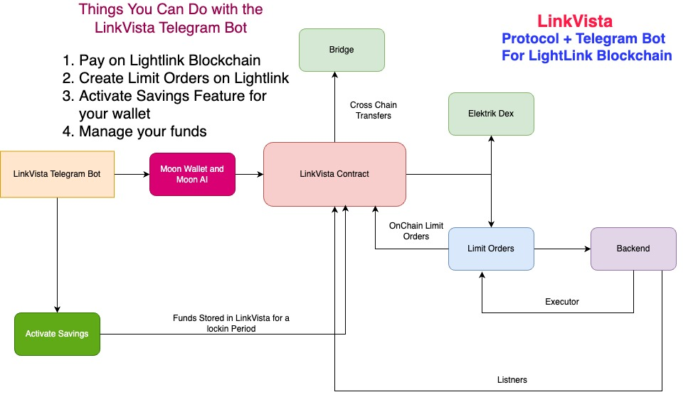

# LinkVista Telegram Bot and Protocol
`Decentralized Finance (DeFi) Telegram Bot for Lightlink Blockchain`

## Project Description:

Welcome to LinkVista, your all-in-one decentralized financial companion on Telegram! LinkVista revolutionizes the way you interact with the crypto world by seamlessly integrating various decentralized finance (DeFi) functionalities within the Telegram platform on lightlink Blockchain. Experience the future of finance at your fingertips with LinkVista.

## Key Features:

### Pay to Anyone On Lightlink In Just Few Clicks:

Easily make payments using any token of your choice. Automatic conversion Happens in the background, providing a unified and simplified payment experience on lightlink blockchain. No Need to Go to Dexes and do the swaps!

### Decentralized Limit Orders:

Empower your trading strategy with decentralized limit orders. Convert your tokens into other tokens when the token reaches specific price all in totaly decentralised fashion. Execute trades autonomously, directly from the Telegram interface, without the need for third-party exchanges.

You can create
- Same Chain Limit Orders
- Cross Chain Limit Orders(Under Development)

### Activate Savings to Increase your wealth:

You can activate savings feature on your wallet. You start saving a roundUp value of transactions you do with the telegram bot wallet you own. You can choose your own LockIn period for your savings.

You can create:
- Rounds off savings
- Threshold savings(Sweep In)

Your funds are locked in secure smart contract onchain!

## LinkVista Operational Framework:
LinkVista operates through a sophisticated contract architecture that seamlessly interacts with Dexes, Bridges, etc. Moreover, LinkVista extends its capabilities, enabling direct interactions with its contract by any decentralized application (dapp). The Telegram bot acts as the user's gateway, facilitating the account creation process and subsequent interactions with the LinkVista Contract.

## Smart Contracts 

LightLink Pegasus Testnet : https://pegasus.lightlink.io/address/0x17A1d8c3C78b5A79A43B80D143bf15F8Cb3F687F

Powered By MoonAI, Lightlink, Elektrik and Blockscout